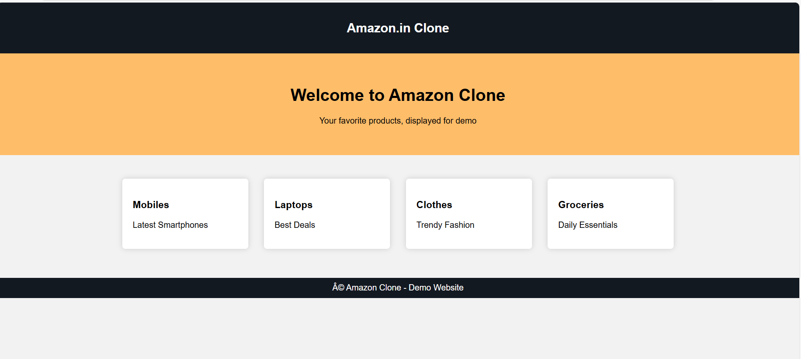

# AWS S3 Static Website Deployment using Terraform

This project demonstrates how to deploy a static website (Amazon Clone) on AWS using Amazon S3 and Terraform.

## Features
- Infrastructure provisioning using Terraform
- Amazon S3 static website hosting
- Public bucket policy configuration
- Automated deployment of HTML and CSS files

## Technologies
- AWS S3
- Terraform
- HTML
- CSS
- Git

## Project Structure

main.tf – AWS S3 bucket configuration  
variables.tf – Terraform variables  
outputs.tf – Output for website URL  
index.html – Main webpage  
error.html – Error page  
style.css – Website styling

## Deployment Steps

1. Initialize Terraform
## Architecture

User → Internet → Amazon S3 Bucket → Static Website Hosting → Website Output
The website files are stored in an Amazon S3 bucket. Terraform provisions
the infrastructure and uploads the website files automatically.
Amazon S3 static website hosting serves the website through a public endpoint.
## Project Screenshots

### Terraform Project Structure

### Website Source Files

 S3 Bucket Created
 [S3 Bucket](screenshots/s3-bucket.png)

### Files Uploaded to S3

### Static Website Hosting Enabled

### Final Website Output

Add Live Website Section
## Live Website

http://rekha-amazon-site-20251117.s3-website.ap-south-1.amazonaws.com
4️⃣ Add Prerequisites Section
## Prerequisites

- AWS Account
- Terraform installed
- AWS CLI configured
5️⃣ Add Cleanup Step
## Cleanup

To remove all resources created by Terraform:

terraform destroy
